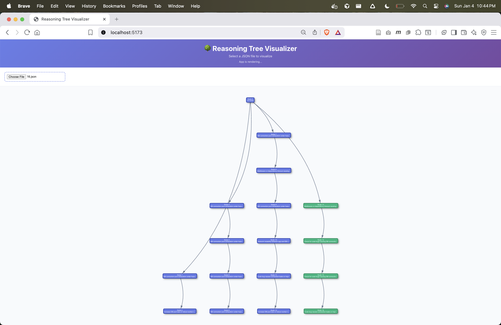

# Pseudo-Recursive Language Model

An experimental system that simulates recursive reasoning behavior in language models without modifying model weights. This project enables a language model to explore multiple reasoning paths through a tree structure, backtrack, and synthesize conclusions from diverse perspectives.




## Overview

Traditional language models process information in a linear, forward-only manner. This experiment implements a **pseudo-recursive** approach where the model:

1. **Builds a reasoning tree** - Each reasoning step becomes a node in a tree structure
2. **Explores multiple paths** - The model is encouraged to explore different approaches, hypotheses, and angles
3. **Backtracks and branches** - After 2-3 steps on one path, the model must navigate back to earlier nodes to explore alternative branches
4. **Synthesizes conclusions** - Only after exploring multiple distinct paths does the model conclude

## How It Works

### Core Components

- **TreeManager**: Manages the reasoning tree structure, tracking nodes, paths, and the current active node
- **Action System**: The model can choose from three actions:
  - `ReasoningTreeNodeToGenerate`: Continue reasoning from the current node (2-3 sentence steps)
  - `MoveToNode`: Navigate back to an earlier node to explore a different branch
  - `FinishedReasoning`: Conclude after exploring multiple paths

### Reasoning Process

1. **Initial State**: Starts with an empty root node
2. **Iterative Reasoning**: For up to 20 iterations:
   - The current reasoning tree (with only active path reasoning visible) is rendered
   - The model receives the tree and user's task
   - The model chooses an action (continue reasoning, move to node, or finish)
   - Actions are logged with full details
   - Tree snapshots are saved at each step

3. **Tree Compression**: Only nodes on the path to the current active node show full reasoning; all other nodes show only brief summaries (collapsed view)

4. **Exploration Requirement**: The system enforces exploration by requiring the model to use `MoveToNode` after 2-3 reasoning steps on one path

### Visualization

A React-based UI (in the `ui/` directory) allows you to visualize reasoning trees:
- Load any tree snapshot JSON file
- See the full tree structure with nodes and connections
- View node details (brief summaries and full reasoning)
- Distinguish between active path nodes (green, with reasoning) and collapsed nodes (purple, brief only)

<!-- Visualization will be added here -->

## Usage

### Running the Reasoning Agent

```bash
python main.py "<your task or question>"
```

Example:
```bash
python main.py "FastAPI service returns intermittent 500s only under load. App logs show TimeoutError sometimes, but ALB metrics show no 5xx spikes. DB shows occasional connection saturation. Give the most likely root cause and a minimal fix, and explain what evidence would falsify your hypothesis."
```

### Viewing Results

All reasoning sessions are saved in `tree_snapshots/{session_id}/`:
- `actions.log`: Plain text log of all actions taken
- `{iteration}.json`: Tree snapshot at each iteration

### Visualizing Trees

```bash
cd ui
npm install
npm run dev
```

Then open the UI in your browser and select a JSON file from `tree_snapshots/` to visualize the reasoning tree.

## Key Features

- **Multi-path exploration**: Encourages exploring different approaches before concluding
- **Tree-based reasoning**: Visual representation of reasoning structure
- **Compressed view**: Only active path shows full reasoning; other branches are collapsed
- **Action logging**: Complete audit trail of all reasoning steps and navigation
- **Interactive visualization**: Web UI to explore reasoning trees

## Project Structure

```
.
├── main.py              # Main entry point for the reasoning agent
├── models.py            # Pydantic models for actions and nodes
├── tree_manager.py      # Tree structure management and rendering
├── logger.py            # Action logging system
├── ui/                  # React-based visualization UI
│   ├── src/
│   │   ├── App.jsx      # Main visualization component
│   │   └── ...
│   └── package.json
└── tree_snapshots/      # Generated reasoning trees
    └── {session_id}/
        ├── actions.log
        └── {iteration}.json
```

## Experiment Goals

This experiment explores:
- Can we simulate recursive reasoning without modifying model weights?
- Does exploring multiple reasoning paths improve problem-solving?
- How does tree-structured reasoning compare to linear reasoning?
- Can we encourage deeper exploration through structural constraints?

## Requirements

- Python 3.12+
- OpenAI API key (set in `.env` file)
- Node.js and npm (for visualization UI)

## Installation

```bash
# Install Python dependencies
pip install -r requirements.txt  # or use uv/pip as appropriate

# Install UI dependencies
cd ui
npm install
```
